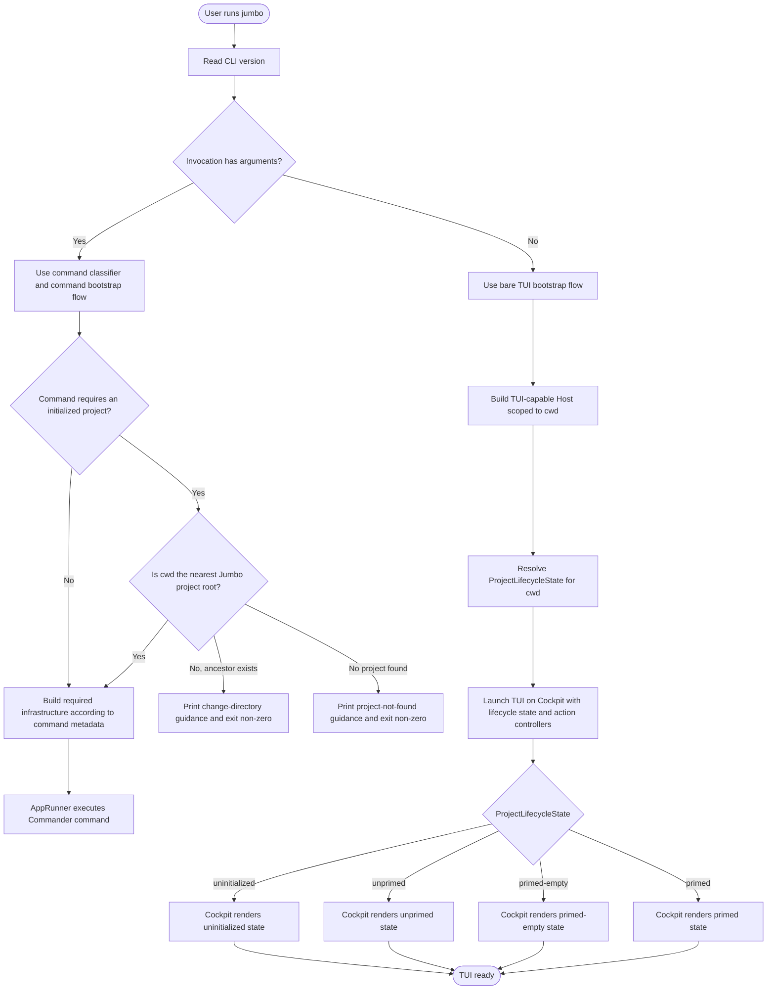

# Bare `jumbo` Command Flow

This document specifies the target flow for running `jumbo` with no arguments.
It exists so the implementation can be checked against a concrete flow before
changing bootstrap or TUI behavior.

## Rules

- Bare `jumbo` always launches the TUI.
- The TUI always opens on Cockpit. There is no initial `init` TUI flow state.
- `ProjectLifecycleState` is resolved for the current working directory before
  Cockpit chooses what to render.
- Cockpit's Events panel renders bounded recent daemon activity from current
  TUI subprocess snapshots; it does not create a separate persisted event stream.
- An ancestor Jumbo project must not make the current directory appear initialized
  for a bare `jumbo` launch.
- If the current working directory is not an initialized Jumbo project, Cockpit
  renders the uninitialized state and may offer initialization actions.
- Project-scoped non-bare commands keep their existing guard behavior and may
  direct the user back to an ancestor project root.

## Flow Chart

## Implementation Checkpoints

- `AppRunner` should construct the TUI launcher with only version and container.
- `TuiApplicationLauncher` should not accept or pass an initial flow prop.
- `TuiApp` should initialize Cockpit as the default screen and keep Init as a
  user-triggered overlay.
- Bare `jumbo` bootstrap should resolve and pass/read a `ProjectLifecycleState`
  scoped to `cwd`; it should not let `findNearest()` make a non-project `cwd`
  inherit an ancestor project's lifecycle.
- Tests should cover these three bare-launch cases:
  - `cwd` is an initialized project root: Cockpit uses project-backed state.
  - `cwd` is inside an ancestor project but is not itself the project root:
    Cockpit uses `cwd` uninitialized state.
  - `cwd` has no ancestor project: Cockpit uses `cwd` uninitialized state.
